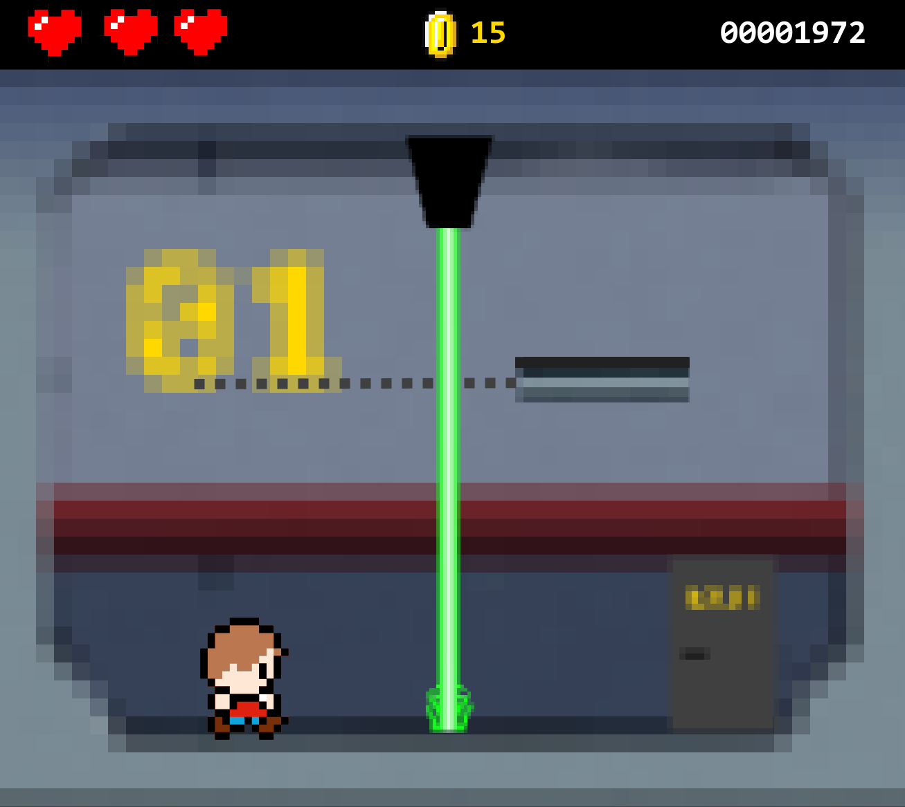
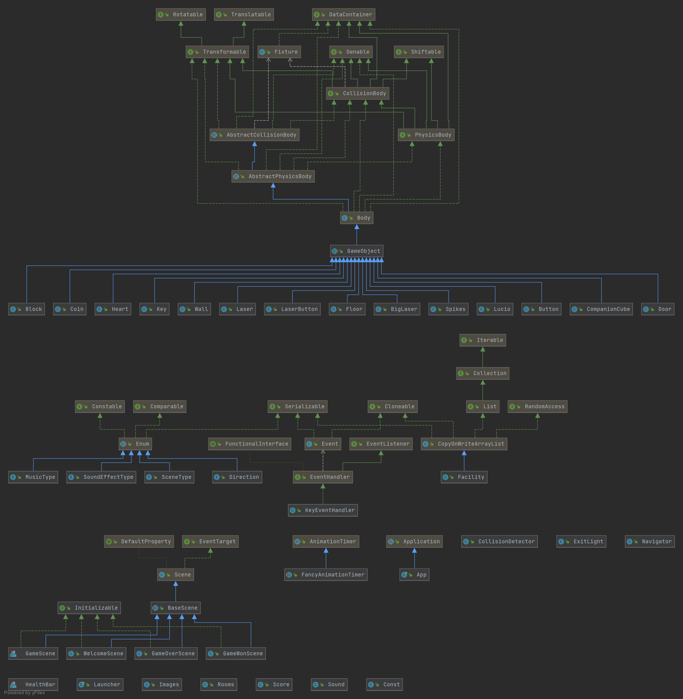

# Lucio’s Abenteuer

# Version 1.0.0, 3. Februar 2020 | Projektteam: Person 1, Person 2

# Inhalt

1  Abstract

2  Anforderungsanalyse

* User Stories
  

3  GUI Design 

* Screen Design

* ERM 
  

4  Fazit 

# Abstract

Unser Game Projekt ist angelehnt an das 2D Spiel Super Mario, allerdings ist das Ziel nicht einfach das Level durchzuspielen und eine Person zu retten, sondern Rätsel zu lösen. In jedem Raum gibt es eine Aufgabe zu bewältigen, um weiter zu kommen. Da dies etwas zu langweilig wäre, gibt es auch Gegner, vor denen man sich in Acht nehmen sollte. 

# Anforderungsanalyse

  
## User Stories

| Funktionale-US-01 | Beschreibung |
| --- | --- |
| User Story | Als Spieler möchte ich, dass die Figur sich von mir steuern lässt. |
| Art | Muss |
| Akzeptanzkriterien | Wenn ich auf die Tasten a,d oder [LEERTASTE] drücke bewegt sich die figur in die gefählte Richtung |

| Funktionale-US-02 | Beschreibung |
| --- | --- |
| User Story | Als Spieler möchte ich einen Raum sehen |
| Art | Muss |
| Akzeptanzkriterien | Wenn ich das Spiel beginne sehe ich ein Raum mit Blöcken, Items, |

| Funktionale-US-03 | Beschreibung |
| --- | --- |
| User Story | Als Spieler möchte ich einen GameScreen haben |
| Art | Muss |
| Akzeptanzkriterien | Wenn ich das Hauptmenu verlasse beginnt das spiel |

| Funktionale-US-04 | Beschreibung |
| --- | --- |
| User Story | Als Spieler möchte ich mehrere Levels haben |
| Art | Muss |
| Akzeptanzkriterien | Wenn ich den ersten Raum verlasse will betrete ich den zweiten Raum. |

| Funktionale-US-05 | Beschreibung |
| --- | --- |
| User Story | Als Spieler möchte ich einen Raum verlassen können |
| Art | Muss |
| Akzeptanzkriterien | Wenn die Figur die Tür berührt verlässt sie den Raum |

| Funktionale-US-06 | Beschreibung |
| --- | --- |
| User Story | Als Spieler möchte ich einen neuen Raum betreten können |
| Art | Muss |
| Akzeptanzkriterien | Wenn die Figur die Tür berührt betritt die den nächsten Raum |

| Funktionale-US-07 | Beschreibung |
| --- | --- |
| User Story | Als Spieler möchte ich einen GameOverScreen haben |
| Art | Muss |
| Akzeptanzkriterien | Wenn die Figur all ihre Lebenspunkte verliert soll der GameOverScreen angezeigt werden. |

| Funktionale-US-08 | Beschreibung |
| --- | --- |
| User Story | Als Spieler möchte ich Items einsammeln können die mir eine Belohnung geben (zum Beispiel. Mehr lebenspunkte). |
| Art | Muss |
| Akzeptanzkriterien | Wenn die Figur ein Herz einsammelt werden verlorene Lebenspunkte regeneriert. |

| Funktionale-US-09 | Beschreibung |
| --- | --- |
| User Story | Als Spieler möchte ich einen StartScreen haben. |
| Art | Muss |
| Akzeptanzkriterien | Wenn ich das Spiel aufstarte sehe ich zuerst ein Hauptmenu. |

| Funktionale-US-10 | Beschreibung |
| --- | --- |
| User Story | Als Spieler möchte ich Hindernisse die mir eine Herausforderung darstellen haben. |
| Art | Muss |
| Akzeptanzkriterien | Wenn die Figur mit diesen Hindernissen in kontakt kommt verliert sie Lebenspunkte. |

| Funktionale-US-11 | Beschreibung |
| --- | --- |
| User Story | Als Spieler möchte ich sehen wie viele Lebenspunkte ich habe |
| Art | Muss |
| Akzeptanzkriterien | Während dem Spiel sehe ich in einer Anzeige oben am Bildschirm wie viele Lebenspunkte die Figur hat. |

| Funktionale-US-12 | Beschreibung |
| --- | --- |
| User Story | Als Spieler möchte ich einen GameWinScreen haben |
| Art | Kann |
| Akzeptanzkriterien | Nachdem ich alle Räume gelöst habe sehe ich einen GameWinScreen. |

| Funktionale-US-13 | Beschreibung |
| --- | --- |
| User Story | Als Spieler möchte ich Aufgaben, welche mich in den nächsten Raum bringen lösen. |
| Art | Muss |
| Akzeptanzkriterien | Um in den nächsten Raum zu gelangen muss die Figur Würfel auf knöpfe legen oder Schlüssel einsammeln. |

| Funktionale-US-14 | Beschreibung |
| --- | --- |
| User Story | Als Spieler möchte ich sehen wie viele münzen ich habe |
| Art | Kann |
| Akzeptanzkriterien | Während dem Spiel sehe ich in einer Anzeige oben am Bildschirm wie viele Münzen die Figur schon eingesammelt hat. |

| Funktionale-US-15 | Beschreibung |
| --- | --- |
| User Story | Als Spieler möchte ich münzen einsammeln können die mir Punkte geben. |
| Art | Kann |
| Akzeptanzkriterien | Wenn die Figur die Münze berührt soll sie verschwinden und die Anzahl eingesammelte Münzen soll um eins steigen. |

  

| Nichtfunktionale-US-01 | Beschreibung |
| --- | --- |
| User Story | Als Spieler möchte ich Gegenspieler die mir eine Herausforderung darstellen. |
| Art | Kann |
| Akzeptanzkriterien | Wenn Die Figur den Gegenspieler berührt verliert sie lebenspunkte.  |
| Begründung | Ein Gegenspieler hätte nicht zu dem Style des Spieles gepasst |

# GUI Design

## Screen Design

.png)
StartScreen
  

.png)
GameScreen LVL1
  

.png)
GameScreen LVL2

  

.png)
GameScreen LVL3

  

.png)
GameScreen LVL4

  
.png)
GameScreen LVL5

  

.png)
GameOverScreen
  

.png)
GameWinScreen

## ERM

# Fazit

Hier kommt eure Reflexion zum Projekt.

- Was lief gut/schlecht?
- Wie seid ihr mit dem Endergebnis zufrieden?
- Was habt ihr gelernt?
- Wie verlief die Zusammenarbeit im Team?
- Ist alles vorhanden oder was fehlt noch?
- Was würdet ihr das nächste Mal anders angehen?
- Etc.